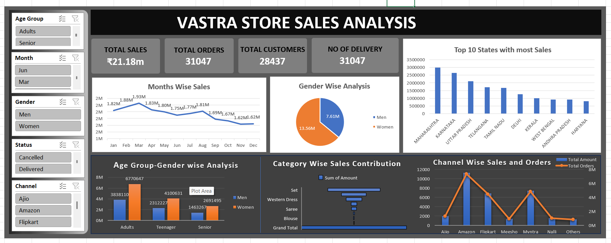

# 📊 VAStra Store Sales Analysis Dashboard

A comprehensive Excel-based Sales Analysis Dashboard built to analyze **VAStra Store's sales performance**, customer behavior, product trends, and regional performance. This project converts raw sales data into actionable business insights using Excel's data analysis and visualization capabilities.

---

## 📖 Project Overview

The **VAStra Store Sales Analysis Project** aims to help business stakeholders monitor sales performance and identify growth opportunities through an interactive dashboard.

The dashboard analyzes multiple business dimensions including:

* Sales Performance
* Customer Demographics
* Product Categories
* Sales Channels
* Delivery Status
* Regional Performance
* Monthly Trends

The project demonstrates practical Business Intelligence and Data Analytics skills using Microsoft Excel.

---

## 🎯 Business Objectives

* Analyze monthly sales trends and identify peak sales periods.
* Understand customer purchasing behavior across gender and age groups.
* Evaluate product category performance.
* Compare sales across different sales channels.
* Analyze state-wise and city-wise sales contribution.
* Track important business KPIs for better decision-making.

---

## 📌 Key Performance Indicators (KPIs)

The dashboard tracks the following KPIs:

* 💰 Total Sales
* 📦 Total Orders
* 👥 Total Customers
* 🚚 Number of Deliveries

---

## 🛠️ Tools & Technologies

* Microsoft Excel
* Power Query
* Pivot Tables
* Pivot Charts
* Slicers
* Dashboard Design
* Data Cleaning & Transformation
* Business Intelligence

---

## 📂 Dataset

The dataset contains retail sales information including:

* Order Details
* Customer Information
* Product Categories
* Sales Amount
* Order Status
* Sales Channel
* State & City
* Gender
* Age Group
* Delivery Status

---

## 📊 Dashboard Features

The interactive dashboard provides insights into:

* 📈 Month-wise Sales Analysis
* 👨‍👩‍👧 Gender-wise Sales Distribution
* 🎯 Age Group Analysis
* 🛍️ Category-wise Sales Contribution
* 🌍 State-wise Sales Performance
* 🏙️ Top 10 Cities by Sales
* 🚚 Delivery Status Analysis
* 🛒 Sales Channel Performance
* KPI Cards for overall business performance

---

## 🔍 Key Insights

### 📅 Monthly Sales Trend

* March generated the highest revenue (**₹19.28 Lakhs**).
* August recorded another significant sales peak due to seasonal and festival demand.
* Sales generally decline after March before recovering in January.

### 👩 Customer Analysis

* Women contribute **64%** of total sales.
* Customers aged **30–50 years** generate the highest revenue.

### 🛍️ Product Performance

The top-performing categories are:

* Sets (50%)
* Kurtas (23%)
* Western Dresses (15%)

Together, these categories contribute approximately **88%** of total sales.

### 🚚 Delivery Performance

* **92%** of all orders are successfully delivered.
* Only **8%** are cancelled, returned, or refunded.

### 🛒 Sales Channels

The highest-performing sales platforms are:

* Amazon
* Myntra
* Flipkart

These platforms generate the majority of both orders and revenue.

### 🌍 Regional Performance

Top-performing states:

* Maharashtra
* Karnataka
* Uttar Pradesh
* Telangana
* Tamil Nadu

Top-performing cities include:

* Bengaluru
* Hyderabad
* New Delhi
* Chennai
* Mumbai
* Pune
* Kolkata
* Lucknow
* Gurugram
* Noida

---

## 💡 Business Recommendations

* Target women aged **30–50 years** through personalized marketing campaigns.
* Increase promotional activities during **March** and **August** to maximize seasonal sales.
* Prioritize inventory for high-demand categories such as **Sets**, **Kurtas**, and **Western Dresses**.
* Strengthen partnerships with **Amazon**, **Myntra**, and **Flipkart**.
* Focus marketing efforts on high-performing states like Maharashtra, Karnataka, and Uttar Pradesh.
* Continuously monitor business performance using KPI dashboards for data-driven decision-making.

---

## 📁 Project Structure

```text
VAStra-Sales-Analysis-Project/
│
├── Dashboard.xlsx
├── VASTRA Store Case study.xlsx
├── VASTRA STORE ANALYSIS report.docx
├── Vastra Store analysis project PPT.pptx
├── Images/
│   └── Dashboard Screenshot.png
└── README.md
```

---

## 🚀 Skills Demonstrated

* Data Cleaning
* Data Transformation
* Dashboard Design
* Business Intelligence
* Sales Analytics
* Data Visualization
* KPI Reporting
* Business Analysis
* Retail Analytics
* Microsoft Excel

---

## 📷 Dashboard Preview

[]

Example:

```text
Images/dashboard.png
```

---

## 📈 Project Outcomes

This project helps businesses:

* Monitor overall sales performance.
* Identify top-performing products and regions.
* Understand customer demographics.
* Improve inventory planning.
* Optimize marketing campaigns.
* Support strategic business decisions using data.

---

## 🤝 Connect With Me

**Aman Kumar**

* GitHub: https://github.com/amanviratian-creator
* LinkedIn: *(www.linkedin.com/in/aman-kumar-mus)*

If you found this project useful, consider giving it a ⭐ on GitHub!
